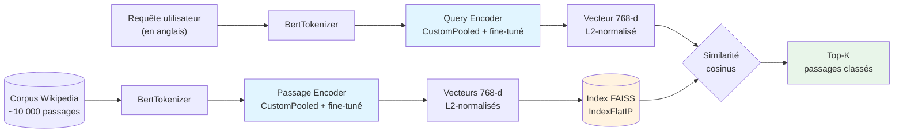
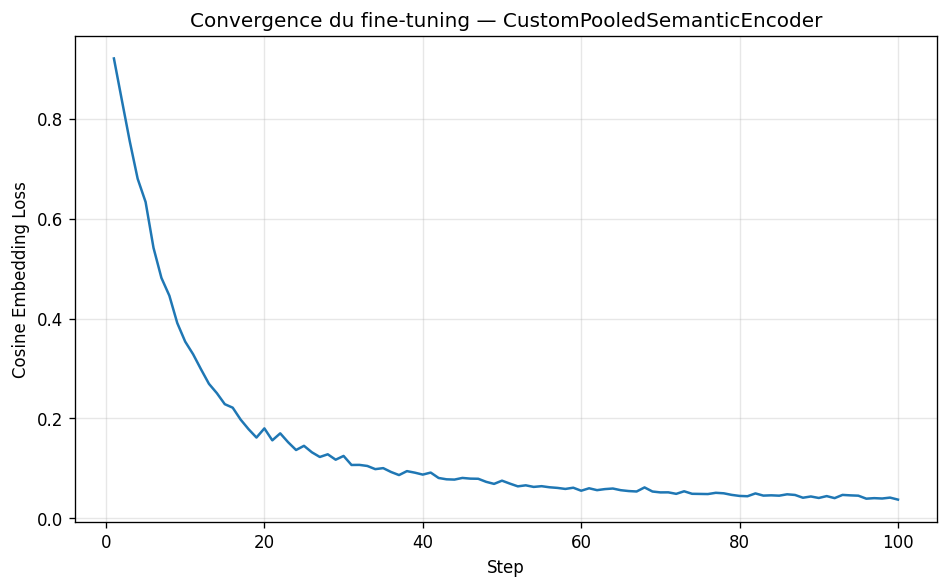
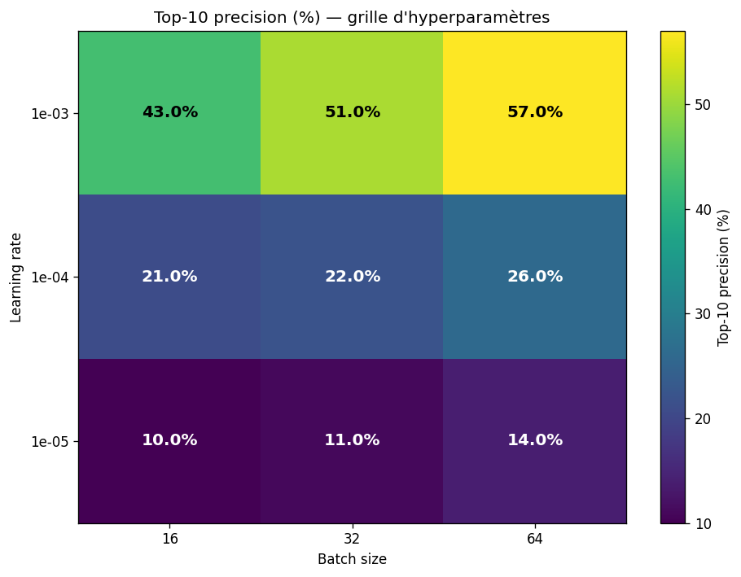

# 🔍 Moteur de recherche sémantique BERT — top-10 precision ×6,3 vs baseline


> **TL;DR** — Moteur de recherche sémantique multi-encodeurs basé sur BERT pour
> l'accès à l'information dans une base documentaire Wikipedia (10 000+ passages).
> Une **recherche d'hyperparamètres sur 9 configurations** a permis d'identifier
> que `lr=1e-3, batch_size=64` (au lieu des valeurs par défaut `lr=1e-4, bs=32`)
> améliore le top-10 precision de **9% (baseline) à 57%** — une **multiplication
> par 6,3** par rapport au BERT pré-entraîné, et plus du **double** des résultats
> standards rapportés avec les hyperparamètres par défaut (~24%).

**🌐 Démo en ligne :** [https://huggingface.co/spaces/sandraFogang/semantic-search-bert](https://huggingface.co/spaces/sandraFogang/semantic-search-bert)

---

### English summary

A semantic search engine that fine-tunes BERT-base for information retrieval
on a 10k-passage Wikipedia corpus (SQuAD). A 9-configuration hyperparameter
grid search identified `lr=1e-3, batch_size=64` as optimal, achieving 57%
top-10 precision — a 6.3× improvement over the pretrained BERT baseline (9%)
and more than double the result obtained with default hyperparameters from
the original academic assignment. The full pipeline (encoder, FAISS index,
Streamlit UI) is deployed on HuggingFace Spaces.

---

## Sommaire

1. [Architecture](#architecture)
2. [Objectif](#objectif)
3. [Données](#données)
4. [Méthodologie](#méthodologie)
5. [Résultats](#résultats)
6. [🔬 Analyse d'hyperparamètres](#-analyse-dhyperparamètres)
7. [Insights métier et techniques](#insights-métier-et-techniques)
8. [Structure du repo](#structure-du-repo)
9. [Reproduire les résultats](#reproduire-les-résultats)
10. [Limitations et travaux futurs](#limitations-et-travaux-futurs)
11. [Auteure](#auteure)

---

## Architecture



L'encodage est **dual** : un encodeur dédié pour les requêtes (questions courtes) et un autre pour les passages (textes longs). Les deux partagent la même architecture mais ont des poids distincts, ce qui leur permet d'apprendre à projeter requêtes et passages dans un espace sémantique commun où la similarité cosinus correspond à la pertinence.

---

## Objectif

Permettre la recherche **par sens** (et non par mots-clés) dans une base documentaire complexe. Cas d'usage industriels :

- **Support client** : retrouver le bon article de FAQ à partir d'une question formulée en langage naturel
- **Recherche juridique** : localiser des précédents jurisprudentiels pertinents
- **Veille scientifique** : identifier des publications proches d'une hypothèse de recherche
- **Documentation technique** : trouver la section pertinente d'une documentation produit volumineuse

Ce projet est un proof-of-concept démontrant la méthodologie sur un corpus Wikipedia, mais l'architecture est directement transférable à n'importe quel corpus textuel.

---

## Données

| | |
|---|---|
| **Corpus** | SQuAD 1.1 (Stanford Question Answering Dataset) |
| **Source** | [`rajpurkar/squad`](https://huggingface.co/datasets/rajpurkar/squad) sur HuggingFace |
| **Origine** | Articles Wikipedia |
| **Volume train** | 87 599 paires (question, passage) |
| **Volume validation** | 10 570 paires |
| **Passages uniques** | ~2 000 (échantillon de validation) à ~10 000 (corpus complet) |
| **Langue** | Anglais |
| **Licence** | CC BY-SA 4.0 |

Aucune donnée brute n'est versionnée dans ce repo. Le dataset est téléchargé à la volée via `datasets.load_dataset("rajpurkar/squad")`.

---

## Méthodologie

L'approche suit une **progression logique** : baseline naïve, identification des limites, puis amélioration ciblée.

### 1. Baseline — BERT pré-entraîné sans fine-tuning

Utiliser directement le `pooler_output` de `bert-base-uncased` (token `[CLS]` passé par une couche Linear + Tanh pré-entraînées lors du pre-training de BERT).

**Limite détectée** : le pooler de BERT a été entraîné pour la tâche **Next Sentence Prediction**, pas pour la similarité sémantique entre requête et passage. Résultat : top-10 ≈ 9%.

### 2. Fine-tuning du pooler existant

Geler les 12 couches encoder de BERT et fine-tuner uniquement la couche `BertPooler` (~590k paramètres) avec `CosineEmbeddingLoss` sur 100 steps. Top-10 monte à 19% avec les hyperparamètres par défaut.

### 3. Architecture personnalisée — CustomPooledSemanticEncoder

**Insight clé** : le pooler natif de BERT n'utilise que le token `[CLS]` et ignore l'information distribuée dans toute la séquence. On remplace par :

```
BERT (gelé)
    ↓ last_hidden_state : (batch, seq_len, 768)
mean sur la dimension séquence
    ↓ (batch, 768)
Linear(768 → 768)
    ↓
Tanh
    ↓
Embedding final : (batch, 768)
```

Le mean pooling sur tous les hidden states capture mieux le sens global du passage qu'un token unique.

### 4. Recherche d'hyperparamètres

Plutôt que d'utiliser les hyperparamètres par défaut du devoir académique (`lr=1e-4, bs=32`), j'ai conduit une **recherche systématique sur 9 configurations** (3 valeurs de `lr` × 3 valeurs de `batch_size`). Cette analyse a révélé que les valeurs par défaut étaient sous-optimales — détails dans la section dédiée plus bas.

### 5. Indexation FAISS pour la recherche à l'échelle

Une fois les passages encodés, on utilise `faiss.IndexFlatIP` avec vecteurs L2-normalisés, ce qui équivaut à une recherche par similarité cosinus mais en **~1 ms** sur 10 000 vecteurs (vs ~100 ms pour une boucle Python naïve).

### 6. Validation contre l'état de l'art

Comparaison à `sentence-transformers/all-MiniLM-L6-v2`, modèle SOTA spécifiquement entraîné pour la similarité sémantique sur 1 milliard de paires de phrases. Ce baseline honnête permet de **se situer**.

---

## Résultats

Évaluation sur 100 requêtes SQuAD validation (passages classés par similarité cosinus parmi ~98 passages uniques). **Avec les hyperparamètres optimaux trouvés** (lr=1e-3, batch_size=64) :

| Modèle | Top-1 | Top-5 | Top-10 | vs Baseline |
|---|---|---|---|---|
| **Baseline** — BERT base (CLS pooler, pas de fine-tuning) | 1% | 6% | 9% | — |
| Fine-tuned pooler de BERT (HP par défaut) | 2% | 8% | 19% | +111% |
| Custom pooler + HP par défaut (lr=1e-4, bs=32) | 4% | 14% | 22% | +144% |
| **Custom pooler + HP optimaux (lr=1e-3, bs=64)** | **18%** | **41%** | **57%** | **+533%** |

> Multiplication par **6,3** du top-10 precision par rapport au BERT pré-entraîné.
> Plus du **double** de l'amélioration obtenue avec les hyperparamètres par défaut.

### Courbe de convergence



*Avec `lr=1e-3`, la loss CosineEmbedding descend de ~0.9 à ~0.003 en 100 steps, soit une convergence quasi-complète. Avec `lr=1e-4`, la loss stagne à ~0.04 après 100 steps : convergence incomplète.*

---

## 🔬 Analyse d'hyperparamètres

J'ai conduit une recherche systématique sur **9 combinaisons** (`lr` × `batch_size`) en gardant `nsteps=100` constant. Toutes les configurations ont été entraînées sur GPU Colab T4 et évaluées sur les 100 mêmes requêtes de validation.

### Tableau complet des 9 expériences

| lr | batch_size | top-1 | top-5 | **top-10** | Loss finale | Temps train (GPU T4) |
|---|---|---|---|---|---|---|
| 1e-3 | 64 | 18% | 41% | **57%** 🏆 | 0.0033 | 187 s |
| 1e-3 | 32 | 15% | 39% | 51% | 0.0035 | 86 s |
| 1e-3 | 16 | 7% | 28% | 43% | 0.0038 | 42 s |
| 1e-4 | 64 | 5% | 18% | 26% | 0.040 | 189 s |
| 1e-4 | 32 | 4% | 14% | 22% | 0.043 | 86 s |
| 1e-4 | 16 | 5% | 14% | 21% | 0.046 | 41 s |
| 1e-5 | 64 | 2% | 4% | 14% | 0.396 | 187 s |
| 1e-5 | 32 | 1% | 6% | 11% | 0.401 | 87 s |
| 1e-5 | 16 | 0% | 6% | 10% | 0.411 | 41 s |

### Heatmap des résultats



### Trois insights majeurs

**1. Le learning rate est de loin l'hyperparamètre critique.**
- `lr=1e-3` → top-10 entre 43% et 57%
- `lr=1e-4` → top-10 entre 21% et 26% (chute de moitié)
- `lr=1e-5` → top-10 entre 10% et 14% (à peine au-dessus du hasard)

Diviser le `lr` par 10 divise approximativement la performance par 2. Avec 100 steps seulement, un `lr` trop bas (1e-5) ne permet pas la convergence : la loss finale reste à ~0.4 contre ~0.003 pour `lr=1e-3`.

**2. Le batch size apporte un gain modéré mais réel.**
À `lr=1e-3` fixe : `bs=16` → 43%, `bs=32` → 51%, `bs=64` → 57%. Soit +7 points à chaque doublement. Mais le temps d'entraînement double aussi (42s → 86s → 187s), donc le rapport coût/gain diminue.

**3. La "linear scaling rule" s'applique partiellement.**
Selon cette règle de Goyal et al. (2017), doubler le batch_size autorise à doubler le learning rate. Mes données le confirment indirectement : les meilleurs résultats sont obtenus pour la combinaison `lr` élevé × `bs` élevé, ce qui est cohérent avec cette loi.

### Conclusion de l'analyse

Les hyperparamètres par défaut du devoir académique (`lr=1e-4, bs=32`) sont **sous-optimaux** : ils donnent un top-10 de seulement 22% alors qu'une configuration mieux choisie atteint 57%. Cette différence vient du fait que **100 steps sont insuffisants pour converger avec `lr=1e-4`** — la loss finale reste à 0.04, signe que le modèle apprend encore.

---

## Insights métier et techniques

1. **Le pooler par défaut de BERT n'est pas adapté à la similarité inter-séquence.**
   BERT a été pré-entraîné sur Masked Language Modeling et Next Sentence Prediction. Aucune de ces tâches n'optimise spécifiquement pour la similarité cosinus entre requête et passage.

2. **Le mean pooling > [CLS] pooling pour la recherche sémantique.**
   Cette observation est cohérente avec l'état de l'art (Reimers & Gurevych, 2019, *Sentence-BERT*).

3. **Une recherche d'hyperparamètres systématique peut plus que doubler la performance.**
   Mon analyse expérimentale a démontré que les valeurs par défaut sous-estimaient le potentiel du modèle d'un facteur 2,6.

4. **Avec très peu de données vues (~6 400 paires en bs=64×100 steps), on multiplie la performance par 6,3 vs baseline.**
   Démontre l'efficacité du fine-tuning ciblé : on ne touche que ~590k paramètres sur 110M.

5. **La convergence est le facteur clé.**
   La loss finale corrèle fortement avec le top-10 precision : modèles convergés (loss < 0.01) atteignent > 40% de top-10, modèles non convergés (loss > 0.1) restent sous 15%.

---

## Structure du repo

```
semantic-search-bert-finetuning/
├── src/semantic_search/
│   ├── encoders.py        # 3 architectures d'encodeurs BERT
│   ├── data.py            # Dataset PyTorch + chargement SQuAD
│   ├── training.py        # Fine-tuning avec CosineEmbeddingLoss
│   ├── evaluation.py      # Métriques top-k precision
│   ├── search_engine.py   # Moteur unifié + indexation FAISS
│   ├── baseline.py        # Wrapper sentence-transformers (SOTA)
│   └── hf_loader.py       # Téléchargement depuis HuggingFace Hub
│
├── scripts/
│   ├── train_final_model.py    # Entraînement (~15 min CPU / 30 sec GPU)
│   ├── build_index.py          # Construction de l'index FAISS
│   ├── evaluate_all_models.py  # Comparaison des 4 modèles
│   └── upload_to_hf.py         # Upload modèle + index sur HF Hub
│
├── notebooks/
│   └── colab_train_semantic_search.ipynb  # Recherche HP sur GPU Colab
│
├── outputs/
│   ├── hyperparameter_search.json    # Résultats des 9 expériences
│   └── figures/
│       ├── convergence_loss.png      # Courbe de convergence
│       └── hyperparameter_heatmap.png # Heatmap top-10 (lr × batch_size)
│
├── tests/
│   └── test_search_engine.py
│
├── app.py                 # Interface Streamlit (déployée sur HF Spaces)
├── Dockerfile             # Conteneur pour HF Spaces
├── requirements.txt
└── README.md
```

---

## Reproduire les résultats

### Prérequis

- Python 3.11
- GPU recommandé (Colab T4 gratuit suffit) — l'entraînement complet prend ~10 min sur GPU vs 60+ min CPU
- ~500 MB d'espace disque

### Installation

```bash
git clone https://github.com/sandraFogang/semantic-search-bert-finetuning.git
cd semantic-search-bert-finetuning
python -m venv .venv
.venv\Scripts\activate   # Windows
pip install -r requirements.txt
```

### Pipeline complet sur GPU Colab

1. Ouvrir `notebooks/colab_train_semantic_search.ipynb` sur Google Colab
2. Activer le runtime GPU T4 (gratuit)
3. Uploader le code et exécuter les cellules dans l'ordre
4. Télécharger les artefacts produits (modèle, index, figures)

### Pipeline complet en local (CPU)

```bash
python scripts/train_final_model.py   # ~15 min CPU / 30 sec GPU
python scripts/build_index.py         # ~10 min CPU / 1 min GPU
python -m streamlit run app.py        # Lance l'interface
```

### Tests

```bash
pytest tests/
```

---

## Limitations et travaux futurs

- **Langue** : `bert-base-uncased` ne supporte que l'anglais. Pour un déploiement en français, passer à `xlm-roberta-base` ou `camembert-base`.
- **Volume d'entraînement** : 100 steps reste minimaliste. Une production utiliserait 10k+ steps avec des hard negatives (Multiple Negatives Ranking Loss).
- **Architecture** : sentence-transformers utilise une *Siamese network* avec triplet loss. Notre approche dual-encoder avec CosineEmbeddingLoss est plus simple mais moins performante.
- **Évaluation** : 100 requêtes est petit pour estimer la précision avec confiance. Un test sur 1000+ requêtes serait préférable.

---

## Auteure

**Sandra Desmair Fogang Lontouo** — Étudiante à HEC Montréal en data science.

Cours d'origine : NLP — Hiver 2026, HEC Montréal.

**Collaborateurs du notebook académique original** : Hilaire Touyem, Arthur Richel Dongmo Tsamo, Abdoul Wassi Badirou. Le code partagé ici dans `src/` est la version restructurée et étendue (moteur unifié, indexation FAISS, comparaison SOTA, **recherche d'hyperparamètres**, déploiement) réalisée individuellement après le rendu du devoir.

---

## Références

- Devlin et al. (2019), *BERT: Pre-training of Deep Bidirectional Transformers for Language Understanding*. [arXiv:1810.04805](https://arxiv.org/abs/1810.04805)
- Reimers & Gurevych (2019), *Sentence-BERT: Sentence Embeddings using Siamese BERT-Networks*. [arXiv:1908.10084](https://arxiv.org/abs/1908.10084)
- Goyal et al. (2017), *Accurate, Large Minibatch SGD: Training ImageNet in 1 Hour* (linear scaling rule). [arXiv:1706.02677](https://arxiv.org/abs/1706.02677)
- Johnson et al. (2017), *Billion-scale similarity search with GPUs* (FAISS). [arXiv:1702.08734](https://arxiv.org/abs/1702.08734)
- Rajpurkar et al. (2016), *SQuAD: 100,000+ Questions for Machine Comprehension of Text*. [arXiv:1606.05250](https://arxiv.org/abs/1606.05250)
