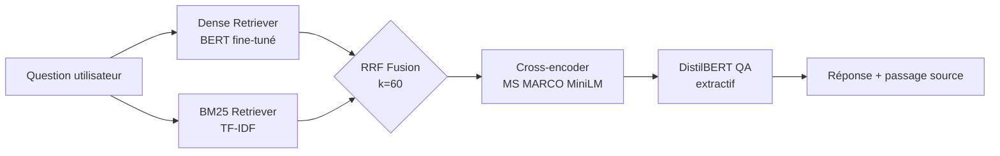
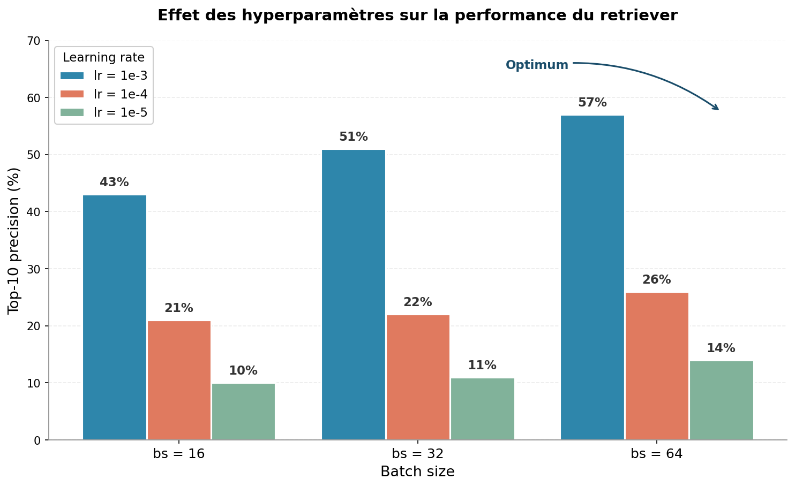
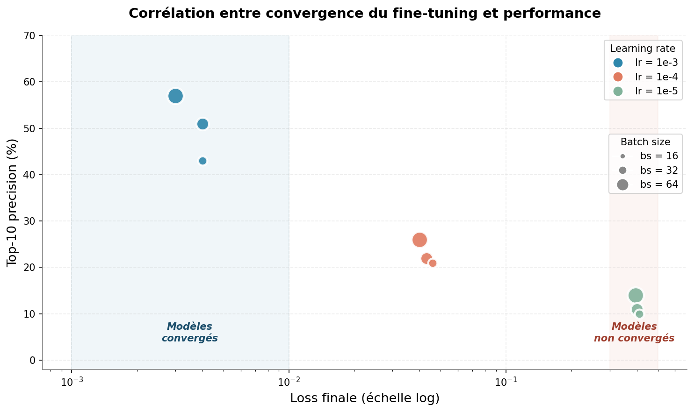

# Système RAG hybride pour la recherche sémantique dans Wikipedia

Un système de question-réponse end-to-end qui combine recherche sémantique (BERT fine-tuné), recherche par mots-clés (BM25), reranking par cross-encoder et extraction de réponse (DistilBERT). Indexé sur 20 000 passages Wikipedia issus du corpus SQuAD.

**Démo en ligne :** [huggingface.co/spaces/sandraFogang/semantic-search-bert](https://huggingface.co/spaces/sandraFogang/semantic-search-bert)


## Ce que fait le projet

Quand on pose une question en langage naturel comme *"Which NFL team represented the NFC at Super Bowl 50?"*, le système retrouve les passages Wikipedia pertinents parmi 20 000 documents et en extrait la réponse exacte (*Carolina Panthers*, avec un score de confiance de 80%).

Concrètement, c'est utile pour :
- la documentation technique volumineuse, où une recherche par mots-clés rate les paraphrases
- les bases de connaissances internes (FAQ, jurisprudence, recherche médicale)
- les chatbots qui doivent ancrer leurs réponses dans des sources vérifiables

L'architecture suit le pattern RAG (Retrieval-Augmented Generation) standard en production : on récupère d'abord, puis on raffine, puis on extrait.

## Architecture



Trois étapes :

1. **Hybrid retrieval.** Deux retrievers en parallèle. Le dense (notre BERT custom) capture la similarité sémantique — il sait que "auteur de Hamlet" et "Shakespeare wrote" parlent de la même chose. BM25 capture les mots-clés rares — il trouve "Super Bowl 50" comme une expression spécifique. Leurs rankings sont fusionnés par Reciprocal Rank Fusion, une méthode robuste qui ne nécessite pas de calibrer les scores.

2. **Reranking.** Les 20 candidats issus de la fusion sont reclassés par un cross-encoder (`ms-marco-MiniLM-L-6-v2`). Contrairement aux bi-encoders qui calculent les embeddings séparément, un cross-encoder regarde (question, passage) ensemble et donne un score de pertinence plus précis. Plus lent, mais sur 20 candidats c'est négligeable.

3. **Extraction.** Les 5 meilleurs passages sont passés à DistilBERT QA, pré-entraîné sur SQuAD. Il identifie l'empan de texte exact qui répond à la question, avec un score de confiance.

## Performance

Le retriever dense seul, évalué isolément sur 100 requêtes SQuAD :

| Modèle | Top-1 | Top-5 | Top-10 |
|---|---|---|---|
| BERT base (sans fine-tuning) | 1% | 6% | 9% |
| Fine-tuning naïf (hyperparamètres par défaut) | 4% | 14% | 22% |
| **Fine-tuning avec hyperparamètres optimisés** | **18%** | **41%** | **57%** |

L'amélioration de ×6.3 sur le top-10 vient d'une recherche d'hyperparamètres systématique (9 configurations testées). Le détail est dans la section ci-dessous.

Avec l'architecture hybride complète (dense + BM25 + reranking + QA), la performance dépend du type de question : sur des questions factuelles SQuAD, les bons passages remontent dans le top-3 dans la grande majorité des cas. Pour des sujets hors corpus, le système retourne "aucune réponse fiable" plutôt que d'inventer — comportement attendu d'un système honnête.

## Recherche d'hyperparamètres

La recherche systématique a été motivée par une observation : avec les valeurs par défaut souvent recommandées dans la littérature pédagogique (`lr=1e-4, batch_size=32`), le top-10 plafonnait à 22%. Suspectant un sous-apprentissage, j'ai testé 9 combinaisons sur GPU Colab T4.



Le learning rate domine très largement : diviser `lr` par 10 divise approximativement la performance par 2. Le batch size apporte un gain plus modéré mais cohérent (+7 points entre bs=16 et bs=64 à lr fixe), comportement attendu par la *linear scaling rule* (Goyal et al., 2017) qui veut qu'on puisse augmenter le learning rate en proportion du batch size.

Mais la vraie histoire se voit en regardant la loss finale du fine-tuning :



Avec `lr=1e-5`, la loss reste à ~0.4 après 100 steps — le modèle n'a tout simplement pas eu le temps de converger, ce qui explique sa performance médiocre (10-14%). À l'inverse, `lr=1e-3` permet une convergence quasi-complète (loss < 0.005) et débloque des scores >40%. La performance n'est donc pas une affaire de "magie" du learning rate, mais une conséquence directe du fait que le modèle a effectivement appris ou non.

Conclusion pratique : pour le fine-tuning court (≤ 100 steps), il faut un learning rate agressif. Les valeurs "sûres" héritées du pre-training BERT sont trop conservatrices et donnent une fausse impression que le fine-tuning ne fonctionne pas.


## Données

Le corpus est SQuAD 1.1 ([rajpurkar/squad](https://huggingface.co/datasets/rajpurkar/squad) sur HuggingFace), composé de 87 599 paires (question, passage) en train et 10 570 en validation, extraites de 536 articles Wikipédia (musique, sciences, histoire, sports). La licence est CC BY-SA 4.0.

Pour l'indexation finale, j'ai pris l'union des passages uniques de train + val, soit environ 20 000 documents. Les questions de validation servent à mesurer la qualité du retrieval.

Aucune donnée brute n'est versionnée dans le repo — tout est téléchargé à la volée via la librairie `datasets`.

## Structure du repo

```
semantic-search-bert-finetuning/
├── src/semantic_search/
│   ├── encoders.py          # 3 architectures BERT (baseline, fine-tuned, custom pooled)
│   ├── data.py              # Loaders SQuAD val et train+val étendu
│   ├── training.py          # Fine-tuning CosineEmbeddingLoss
│   ├── evaluation.py        # Métriques top-k
│   ├── search_engine.py     # Retrieval dense + FAISS
│   ├── bm25_retriever.py    # BM25 + Reciprocal Rank Fusion
│   ├── reranker.py          # Cross-encoder reranking
│   ├── qa.py                # QA extractif DistilBERT
│   ├── hybrid_search.py     # Orchestration du pipeline
│   ├── baseline.py          # Wrapper sentence-transformers (comparaison SOTA)
│   └── hf_loader.py         # Téléchargement artefacts depuis HF Hub
│
├── scripts/                 # Entraînement, indexation, upload HF
├── notebooks/               # Recherche d'hyperparamètres + indexation GPU
├── outputs/figures/         # Heatmap, courbes de convergence
├── tests/
├── app.py                   # Interface Streamlit (HF Spaces)
├── app_local.py             # Version locale
├── Dockerfile
├── requirements.txt
└── README.md
```

## Installation et reproduction

Prérequis : Python 3.11, environ 500 MB d'espace disque. Un GPU n'est pas nécessaire pour l'inférence (l'app tourne sur CPU). Pour réentraîner, un GPU est fortement recommandé — Colab T4 suffit largement.

```bash
git clone https://github.com/sandraFogang/semantic-search-bert-finetuning.git
cd semantic-search-bert-finetuning
python -m venv .venv
.venv\Scripts\activate          # Windows
# ou source .venv/bin/activate  # Linux/macOS
pip install -r requirements.txt
```

Pour reproduire les résultats d'hyperparamètres, ouvrir `notebooks/colab_train_semantic_search.ipynb` sur Colab, activer le GPU T4, et lancer les cellules. La grille complète prend ~15 minutes.

Pour lancer l'app localement (nécessite les artefacts pré-construits) :

```bash
python -m streamlit run app_local.py
```

Les tests passent avec `pytest tests/`.

## Choix techniques et limites

**Pourquoi un retriever custom plutôt que sentence-transformers ?** Pour des raisons d'apprentissage. Le projet démontre la méthodologie d'entraînement d'un encodeur from-scratch sur BERT-base, avec ses pièges (collapse des embeddings, sensibilité au learning rate). Pour une vraie production, `all-MiniLM-L6-v2` serait probablement le bon choix. Une comparaison est fournie dans `baseline.py`.

**Pourquoi l'architecture hybride ?** Le retriever dense seul a des angles morts sur les mots-clés rares (noms propres, termes techniques). BM25 les capture parfaitement. La fusion RRF combine les deux sans nécessiter de calibrer les scores, ce qui la rend robuste.

**Limites connues.** Le corpus SQuAD ne couvre que 536 articles Wikipédia, daté de 2016. Donald Trump, COVID, ou toute actualité récente sont absents. Pour étendre à Wikipédia complet, il faudrait passer à FAISS HNSW et un serveur dédié — environ 80 GB de données à indexer. Le QA extractif a aussi ses limites : il extrait toujours un empan, même quand le passage ne contient pas vraiment la réponse, ce qui produit parfois des réponses absurdes avec une fausse confiance élevée. Une amélioration naturelle serait de remplacer DistilBERT (SQuAD 1.1) par un modèle entraîné sur SQuAD 2.0, qui sait dire "no answer".

## Auteure

Sandra Desmair Fogang Lontouo, M.Sc. en data science à HEC Montréal.

Le notebook initial de fine-tuning BERT a été développé en groupe (Sandra Desmair Fogang Lontouo, Hilaire Touyem, Arthur Richel Dongmo Tsamo, Abdoul Wassi Badirou). Tout ce qui se trouve dans le repo actuel — la restructuration en modules Python, la recherche d'hyperparamètres, l'architecture hybride avec BM25 et reranking, le QA extractif, le packaging Docker, le déploiement HuggingFace Spaces — est mon travail individuel postérieur.

## Références

- Reimers & Gurevych (2019), [Sentence-BERT](https://arxiv.org/abs/1908.10084)
- Devlin et al. (2019), [BERT](https://arxiv.org/abs/1810.04805)
- Cormack et al. (2009), Reciprocal Rank Fusion outperforms Condorcet and individual rank learning methods (SIGIR)
- Goyal et al. (2017), [Linear scaling rule](https://arxiv.org/abs/1706.02677)
- Sanh et al. (2019), [DistilBERT](https://arxiv.org/abs/1910.01108)
- Johnson et al. (2017), [FAISS](https://arxiv.org/abs/1702.08734)
- Rajpurkar et al. (2016), [SQuAD](https://arxiv.org/abs/1606.05250)
